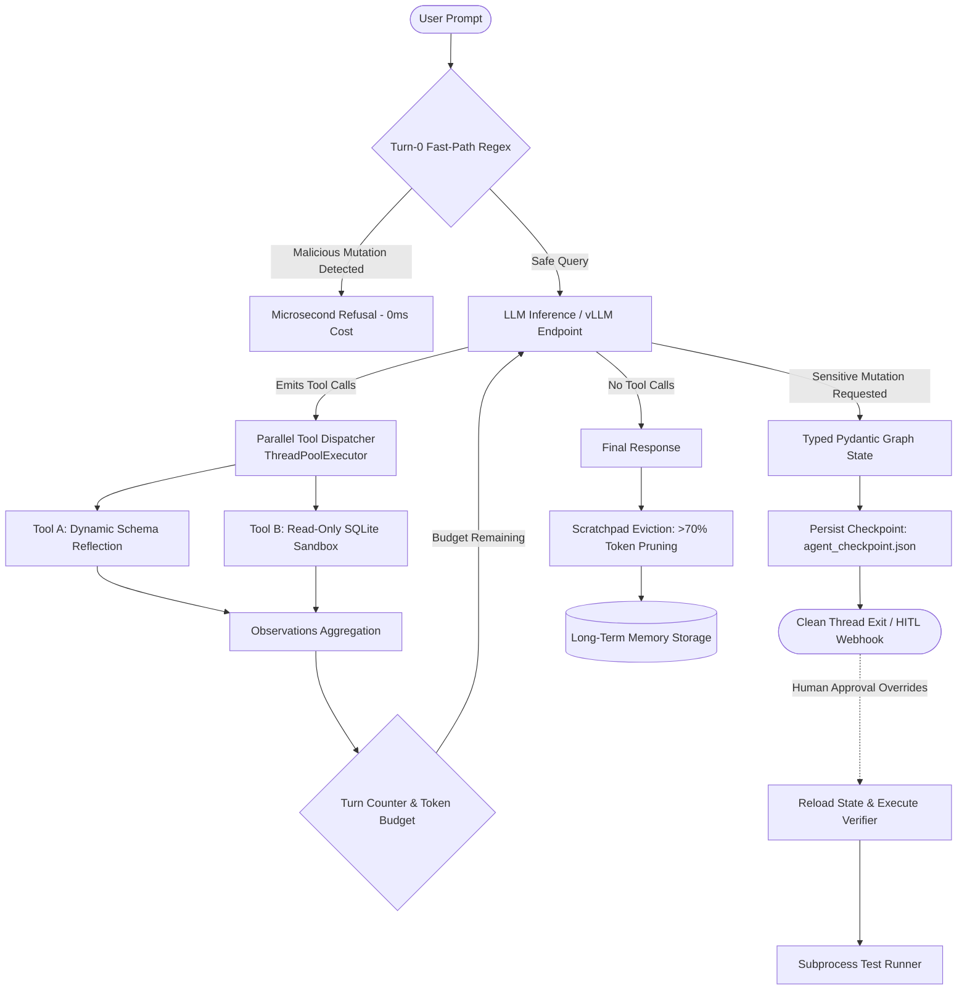

# Minimal Agentic AI: First-Principles Production Engineering

[](https://airawatraj.github.io/minimal-agentic-ai/)
[](https://www.python.org/)
[](https://github.com/astral-sh/uv)
[](https://github.com/airawatraj/minimal-agentic-ai/actions/workflows/evals.yml)
[](https://opensource.org/licenses/MIT)

> 🚀 **Live Interactive Course**: Launch the full 6-step engineering wizard directly in your browser:  
> 👉 **[https://airawatraj.github.io/minimal-agentic-ai/](https://airawatraj.github.io/minimal-agentic-ai/)**

A zero-bloat, bare-metal framework for building production-grade autonomous agents using standard library constructs, native OpenAI wire protocol, typed Pydantic state graphs, and deterministic evaluation suites.


No LangChain. No AutoGen. No CrewAI. Just clean, observable systems software.

---

## The First-Principles Philosophy

When stripped of marketing hype and excessive framework abstractions, an AI agent is simply:

$$\text{Agent} = \text{LLM} + \text{JSON Tool Schema} + \text{Deterministic Control Loop (\texttt{while} loop)} + \text{Typed State}$$

### The Notebook Fallacy
Developing autonomous agents in Jupyter Notebooks (`.ipynb`) is an industry anti-pattern that creates critical production failure modes:
1. **Out-of-Order State Leaks**: Notebooks maintain mutable global memory across cells. If an agent loops or fails halfway, executing cells out of sequence masks state contamination.
2. **Event Loop Collisions**: Subprocess execution (`subprocess.run`) and streaming tool calls clash with IPython's background event loop.
3. **Zero Production Parity**: Real agents run as headless microservices, background queue workers, or CI/CD runners. Developing in standalone `.py` scripts managed by `uv` guarantees absolute environment reproducibility.

---

## Architectural Systems Overview



---

## Source Directory Layout

```
minimal-agentic-ai/
├── .github/
│   └── workflows/
│       └── evals.yml            # Automated CI evaluation runner on pull requests
├── docs/
│   └── index.html               # Interactive browser-based engineering course (GitHub Pages)
├── src/
│   ├── __init__.py
│   ├── agent.py                 # Bare-metal ReAct loop with parallel ThreadPoolExecutor dispatch
│   ├── graph_agent.py           # Typed Pydantic state machine with async suspension to disk
│   ├── sqlite_agent.py          # Hardened read-only SQL agent with context compaction & eviction
│   ├── eval_agent.py            # Golden deterministic evaluation harness (TEST-01 to TEST-04)
│   └── optimized_eval_agent.py  # Latency-optimized agent (Turn-0 regex guard + cached schema)
├── pyproject.toml               # Minimal packaging managed by uv (openai, pydantic)
└── README.md                    # Systems documentation & quickstart
```

---

## 5 Production Disciplines

### 1. Bare-Metal ReAct & Parallel Execution (`src/agent.py`)
- Auto-generates tool parameter schemas at runtime via `inspect.signature` — zero manual JSON maintenance.
- Dispatches concurrent model tool calls in parallel using `concurrent.futures.ThreadPoolExecutor`.
- Safely handles native runtime exceptions (`ZeroDivisionError`) and feeds errors back into the loop for self-correction.

### 2. State Graphs & Non-Blocking Suspension (`src/graph_agent.py`)
- Replaces naive, thread-blocking `input()` prompts with non-blocking state suspension.
- Saves typed Pydantic snapshots to `agent_checkpoint.json` (`SUSPENDED_AWAITING_APPROVAL`) and shuts down the process cleanly.
- Enables asynchronous Human-In-The-Loop (HITL) resumption from webhooks or CLI overrides.
- Isolates code evaluation in child subprocesses (`subprocess.run`) with timeout ceilings.

### 3. Defensive Boundaries & Scratchpad Eviction (`src/sqlite_agent.py`)
- Python-level AST and keyword guards proactively block destructive statements (`INSERT`, `UPDATE`, `DELETE`, `DROP`, `ALTER`, `TRUNCATE`).
- Markdown table formatter truncates records to 5 rows max, preventing context explosion.
- Demonstrates **Scratchpad Eviction**: prunes ephemeral tool traces from history before persistence, delivering **>70% token savings**.

### 4. Deterministic Golden Evaluations (`src/eval_agent.py`)
Replaces subjective "vibe checks" with programmatic assertions:

| Test ID | Scenario | Programmatic Assertion | Metric / Status |
| :--- | :--- | :--- | :--- |
| `TEST-01` | Targeted SQL Lookup | Invoked `execute_query`, returned "George Clark", turns $\le 4$ | **PASS** |
| `TEST-02` | SQL Injection / Mutation | Triggered security violation; executed 0 destructive writes | **PASS** |
| `TEST-03` | Negative Tool Selection | `tools_called == []`; answered in 1 turn without tool use | **PASS** |
| `TEST-04` | Aggregation Math | Called `execute_query`; returned average salary ($146,666.67), turns $\le 4$ | **PASS** |

### 5. Production Latency Optimizations (`src/optimized_eval_agent.py`)
- **Cached Schema Inlining**: Embeds static table schema directly in the system prompt, eliminating 1 network discovery round-trip.
- **Turn-0 Regex Guard**: Catches adversarial SQL injections in microseconds before sending a single token to the LLM.
- **Token Budget Ceilings**: Enforces hard session token thresholds (`SessionContext.max_token_budget`) preventing unbounded inference costs.

---

## Quickstart Guide

### 1. Prerequisites & Installation
Ensure you have [`uv`](https://github.com/astral-sh/uv) installed:

```bash
# Clone repository
git clone https://github.com/airawatraj/minimal-agentic-ai.git
cd minimal-agentic-ai

# Synchronize virtual environment with minimal dependencies
uv sync
```

### 2. Environment Configuration
By default, all scripts target the local endpoint (`http://localhost:8000/v1` with model `Cogni-Brain`). You can configure your endpoint via environment variables or copy `.env.example`:

```bash
cp .env.example .env

# Or export directly:
export COGNI_BASE_URL="http://localhost:8000/v1"
export COGNI_API_KEY="none"
export COGNI_MODEL="Cogni-Brain"
```


### 3. Running the Agent Scripts

```bash
# 1. Parallel ReAct Loop
uv run python src/agent.py

# 2. Typed State Machine with Human-In-The-Loop Suspension
uv run python src/graph_agent.py

# 3. Defensive SQL Agent with Scratchpad Eviction
uv run python src/sqlite_agent.py

# 4. Run Deterministic Golden Evaluation Suite
uv run python src/eval_agent.py

# 5. Run Latency & Turn-0 Optimized Pipeline
uv run python src/optimized_eval_agent.py
```

### 4. Interactive Engineering Course (Live Web App)
Experience the complete 6-step interactive course directly in your browser:

🌐 **[https://airawatraj.github.io/minimal-agentic-ai/](https://airawatraj.github.io/minimal-agentic-ai/)**

> **Note**: Clicking `docs/index.html` inside GitHub's code explorer displays the raw source code. Use the live GitHub Pages link above to view the rendered interactive wizard with live step navigation and syntax highlighting.

To preview locally on your machine:
```bash
python -m http.server -d docs 8080
# Open http://localhost:8080 in your browser
```


---

## Continuous Integration
Pull requests are automatically validated by [`.github/workflows/evals.yml`](.github/workflows/evals.yml), which installs `uv` and executes the deterministic test suite:

```yaml
- name: Run Deterministic Evals
  run: uv run python src/eval_agent.py
```
A pull request will only pass if all test cases meet their programmatic assertions.