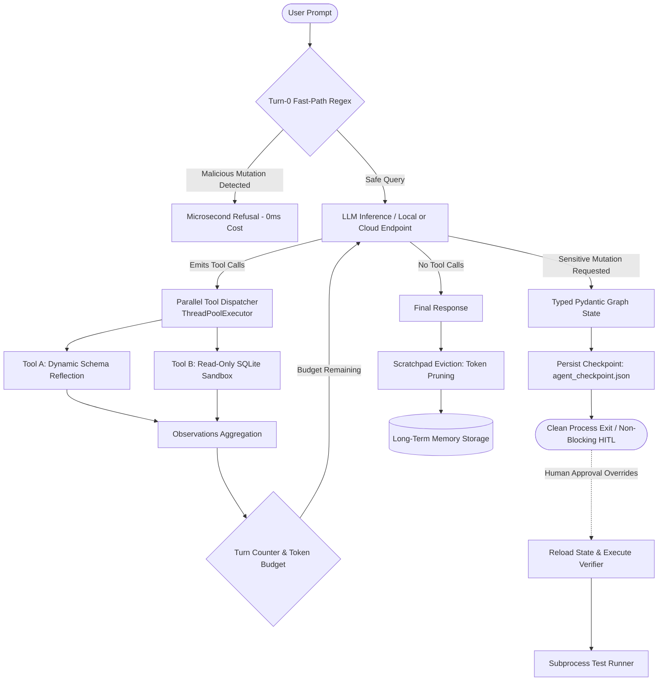

# Minimal Agentic AI

[](https://airawatraj.github.io/minimal-agentic-ai/)
[](https://www.python.org/)
[](https://github.com/astral-sh/uv)
[](https://github.com/airawatraj/minimal-agentic-ai/actions/workflows/evals.yml)
[](https://opensource.org/licenses/MIT)

> 🚀 **Live Interactive Course**: Launch the full 6-step engineering wizard directly in your browser:  
> 👉 **[https://airawatraj.github.io/minimal-agentic-ai/](https://airawatraj.github.io/minimal-agentic-ai/)**

A practical, unpretentious starter kit designed to help developers understand how tool calling, state machines, and evaluation loops work under the hood using native Python.

This repo uses lightweight Python scripts managed by `uv` to keep the codebase minimal, easy to run in the terminal, and directly pluggable into headless CI/CD eval pipelines.

---

## What an Agent is Under the Hood

When stripped of unnecessary abstractions, an AI agent is simply:

$$\text{Agent} = \text{LLM} + \text{JSON Tool Schema} + \text{Deterministic Control Loop (\texttt{while} loop)} + \text{State Container}$$

### What This Repo Provides

Five self-contained, dependency-light steps demonstrating core mechanics:

| Script | Concept Taught | Description |
| :--- | :--- | :--- |
| [`src/agent.py`](src/agent.py) | **Parallel Tool Dispatch** | Dynamic schema generation via `inspect` and concurrent tool execution with `ThreadPoolExecutor`. |
| [`src/graph_agent.py`](src/graph_agent.py) | **State Machine & Suspension** | Typed Pydantic state container with non-blocking disk checkpoints for asynchronous Human-in-the-Loop approval. |
| [`src/sqlite_agent.py`](src/sqlite_agent.py) | **Context Compaction & Eviction** | Read-only SQL safety boundaries, Markdown table formatting, and scratchpad eviction before persistence. |
| [`src/eval_agent.py`](src/eval_agent.py) | **Deterministic Evaluations** | Programmatic assertions benchmarking accuracy, adversarial refusal, and turn limits without subjective vibe checks. |
| [`src/optimized_eval_agent.py`](src/optimized_eval_agent.py) | **Latency Optimizations** | Cached schema inlining, Turn-0 regex fast-path rejection, and cumulative token budget ceilings. |

---

## Architecture Overview



---

## Quickstart Guide

### 1. Setup & Installation

```bash
# Clone repository
git clone https://github.com/airawatraj/minimal-agentic-ai.git
cd minimal-agentic-ai

# Create virtual environment and install dependencies
uv venv && source .venv/bin/activate
uv pip install -r pyproject.toml

# Copy environment template
cp .env.example .env

# Run the ReAct agent
uv run src/agent.py
```

### 2. Environment & Model Compatibility

All scripts connect to any OpenAI-compatible API endpoint—including local inference servers (vLLM, Ollama, llama.cpp) as well as cloud providers (OpenAI, Groq, Together). Configure your endpoint in `.env` or export environment variables directly:

```bash
export COGNI_BASE_URL="http://localhost:8000/v1"
export COGNI_API_KEY="none"
export COGNI_MODEL="Cogni-Brain"
```

### 3. Running the Agent Scripts

```bash
# 1. Parallel ReAct Loop
uv run src/agent.py

# 2. Typed State Machine with Human-In-The-Loop Suspension
uv run src/graph_agent.py

# 3. Defensive SQL Agent with Scratchpad Eviction
uv run src/sqlite_agent.py

# 4. Run Deterministic Golden Evaluation Suite
uv run src/eval_agent.py

# 5. Run Latency & Turn-0 Optimized Pipeline
uv run src/optimized_eval_agent.py
```

### 4. Interactive Engineering Course (Live Web App)

Experience the complete 6-step interactive course directly in your browser:

🌐 **[https://airawatraj.github.io/minimal-agentic-ai/](https://airawatraj.github.io/minimal-agentic-ai/)**

> **Note**: Clicking `docs/index.html` inside GitHub's code explorer displays the raw source code. Use the live GitHub Pages link above to view the rendered interactive wizard with live step navigation and syntax highlighting.

To preview locally on your machine:
```bash
python -m http.server -d docs 8080
# Open http://localhost:8080 in your browser
```

---

## Continuous Integration

Pull requests are automatically validated by [`.github/workflows/evals.yml`](.github/workflows/evals.yml), which installs `uv` and executes the deterministic test suite:

```yaml
- name: Run Deterministic Evals
  run: uv run python src/eval_agent.py
```
A pull request will only pass if all test cases meet their programmatic assertions.